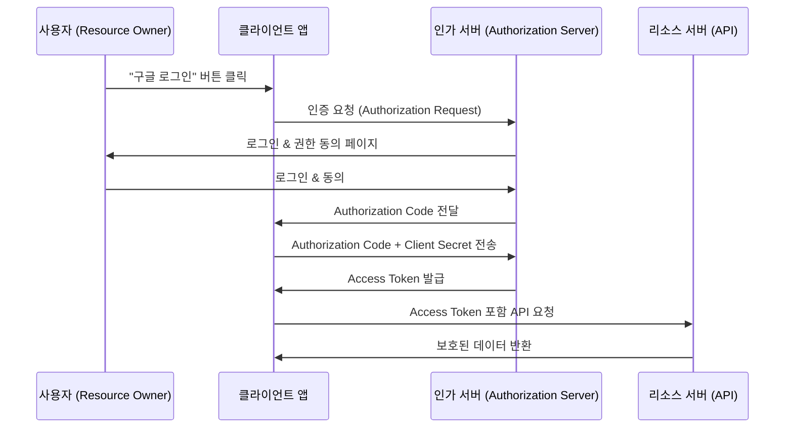

# OAuth 2.0 개요

OAuth 2.0은 인증(Authentication)과 인가(Authorization)를 위한 표준 프로토콜
특히 타사 애플리케이션(Client)이 리소스 소유자(사용자)를 대신해 리소스 서버(API)에 접근할 수 있도록 인가 서버를 통해 Access Token을 발급받아 사용하는 방식

Ex) 구글 계정으로 다른 서비스 로그인, 카카오/네이버 로그인 등.

⸻

# 주요 구성 요소

1.	리소스 소유자 (Resource Owner)
- 보통 사용자(User)
- 자신의 리소스(API 데이터)에 접근 권한을 부여
2.	클라이언트 (Client Application)
- 사용자의 리소스를 사용하려는 앱/서비스
- (예: 인스타그램에 구글 로그인 붙이기)
3.	인가 서버 (Authorization Server)
- 사용자 인증 및 권한 부여 후 Access Token 발급 담당
4.	리소스 서버 (Resource Server)
- 보호된 자원(API 서버) 제공
- Access Token을 검증 후 데이터 반환

⸻

# 동작 플로우 (Authorization Code Grant 예시)

1.	사용자가 클라이언트 앱에서 “구글로 로그인” 클릭
2.	클라이언트 → 인가 서버(구글 인증 페이지)로 리다이렉트
3.	사용자가 구글 로그인 후 권한 동의
4.	인가 서버 → 클라이언트에 Authorization Code 전달
5.	클라이언트 → 인가 서버에 Code와 Client Secret으로 Access Token 요청
6.	인가 서버 → Access Token 발급
7.	클라이언트 → 리소스 서버에 Access Token으로 요청
8.	리소스 서버 → 사용자 데이터 반환

⸻

# 다이어그램

⸻

OAuth 2.0의 장점
	•	비밀번호를 제3자 앱에 직접 제공하지 않아 안전
	•	토큰 기반 → 권한을 제한적으로 위임 가능 (만료시간, 범위 등)
	•	다양한 인증 방식 지원 (Authorization Code, Implicit, Client Credentials, Password 등)

⸻
